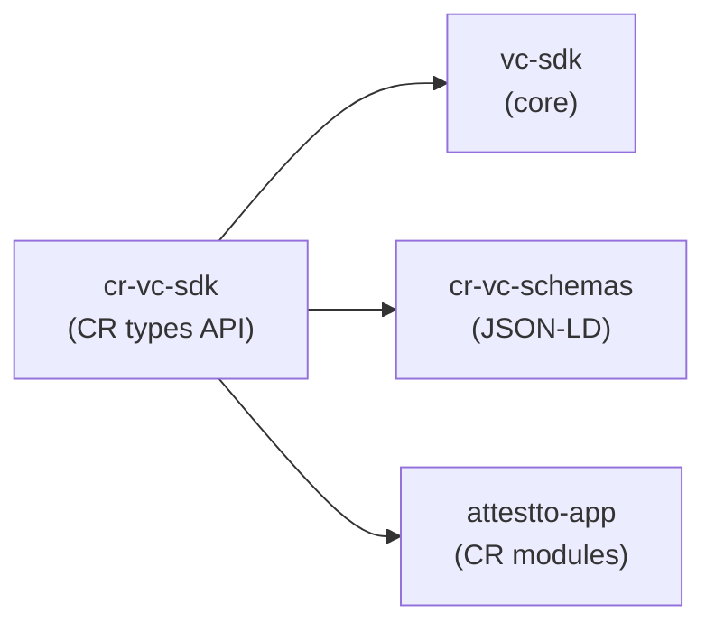

# cr-vc-sdk

[](https://www.npmjs.com/package/@attestto-com/cr-vc-sdk)

> Costa Rica credential types and identity ecosystem

`@attestto-com/cr-vc-sdk` is a TypeScript SDK for issuing and verifying W3C Verifiable Credentials specific to Costa Rica's driving, identity, and government workflows. Extends `@attestto/vc-sdk` with pre-registered schemas for DrivingLicense, medical fitness, vehicle registration, and more. All documentation in English. For full documentation visit [attestto.org/docs](https://attestto.org/docs).

## Architecture



## Quick start

### Prerequisites

- Node ≥ 18
- npm or yarn
- Basic familiarity with `@attestto/vc-sdk`

### Install

```bash
npm install @attestto/cr-vc-sdk
```

### Try it

```typescript
import { VCIssuer, generateKeyPair } from '@attestto/cr-vc-sdk'

const keys = generateKeyPair()
const issuer = new VCIssuer({
  did: 'did:web:cosevi.attestto.id',
  privateKey: keys.privateKey,
})

const license = await issuer.issue({
  type: 'DrivingLicense',
  subjectDid: 'did:web:maria.attestto.id',
  expirationDate: '2032-04-01T23:59:59Z',
  claims: {
    licenseNumber: 'CR-2026-045678',
    categories: ['B', 'A1'],
    issueDate: '2026-04-01',
    status: 'active',
    points: 12,
    bloodType: 'O+',
    restrictions: ['corrective lenses'],
    issuingAuthority: 'did:web:cosevi.attestto.id',
  },
})
```

Verify:

```typescript
import { VCVerifier } from '@attestto/cr-vc-sdk'

const verifier = new VCVerifier()
const result = await verifier.verifyWithKey(license, keys.publicKey, 'Ed25519', {
  checkExpiration: true,
  expectedType: 'DrivingLicense',
  expectedIssuer: 'did:web:cosevi.attestto.id',
})

console.log(result.valid)   // true
console.log(result.errors)  // []
```

## API

### VCIssuer

```typescript
const issuer = new VCIssuer(config: IssuerConfig)
const vc = await issuer.issue(options: IssueOptions)
const jwt = await issuer.issueJwt(options: IssueOptions)
```

Re-exports `VCIssuer` from `@attestto/vc-sdk` with CR schema plugins pre-loaded.

### VCVerifier

```typescript
const verifier = new VCVerifier(config?: VerifierConfig)
const result = await verifier.verify(vc, options?: VerifyOptions)
const result = await verifier.verifyWithKey(vc, publicKey, algorithm, options?)
```

Verifies against known public key or via DID resolver. Returns `{ valid, checks, errors, warnings }`.

### generateKeyPair

```typescript
const keys = generateKeyPair('Ed25519' | 'ES256')
```

Generate Ed25519 or ES256 key pairs for signing and verification.

## Supported credential types

| Type | Domain | Typical issuer |
|---|---|---|
| `DrivingLicense` | Driving | COSEVI / DGEV |
| `TheoreticalTestResult` | Theory exam | DGEV / certified provider |
| `PracticalTestResult` | Practical exam | DGEV / certified provider |
| `NationalID` | Identity | TSE / DGME |
| `PassportCredential` | Travel document | Dirección de Pasaportes |
| `VehicleRegistration` | Registration | Registro Nacional |
| `VehicleInspection` | Technical review (RTV) | RTV center |
| `ProfessionalLicense` | Professional credentials | MICITT / regulatory bodies |
| `SocialSecurityCredential` | CAJA / benefits | CAJA |
| `MedicalRecord` | Health | Authorized clinics |
| `BirthCertificate` | Vital records | TSE |
| `MarriageCertificate` | Vital records | TSE |
| `LandRegistry` | Property | Registro Nacional |

JSON-LD contexts are hosted at `https://schemas.attestto.org/cr/`. See [cr-vc-schemas](https://github.com/Attestto-com/cr-vc-schemas) for full schema definitions.

Indice completo: [Attestto-com/attestto-open](https://github.com/Attestto-com/attestto-open)

| Repositorio | Que hace |
|---|---|
| [vc-sdk](https://github.com/Attestto-com/vc-sdk) | SDK universal W3C VC (TypeScript) |
| [cr-vc-sdk-dotnet](https://github.com/Attestto-com/cr-vc-sdk-dotnet) | SDK ecosistema vial CR (.NET 8) |
| [cr-vc-schemas](https://github.com/Attestto-com/cr-vc-schemas) | Esquemas JSON-LD (11 tipos de VC) |
| [did-sns-spec](https://github.com/Attestto-com/did-sns-spec) | Especificacion del metodo `did:sns` |
| [did-sns-resolver](https://github.com/Attestto-com/did-sns-resolver) | Universal Resolver para did:sns |
| [id-wallet-adapter](https://github.com/Attestto-com/id-wallet-adapter) | Descubrimiento de wallets |

## Ecosystem

| Repo | Role | Relationship |
|---|---|---|
| [vc-sdk](https://github.com/Attestto-com/vc-sdk) | Core SDK | Foundational API this extends |
| [cr-vc-sdk](https://github.com/Attestto-com/cr-vc-sdk) | This repo | CR credential types |
| [cr-vc-schemas](https://github.com/Attestto-com/cr-vc-schemas) | JSON-LD contexts | Schemas for all CR types |
| [attestto-app](https://github.com/Attestto-com/attestto-app) | Citizen wallet | Wallet with CR issuance modules |
| [did-sns-spec](https://github.com/Attestto-com/did-sns-spec) | DID method | Human-readable `did:sns` spec |
| [wallet-identity-resolver](https://github.com/Attestto-com/wallet-identity-resolver) | Identity resolution | On-chain identity lookup |

## Build with an LLM

This repo ships a [`llms.txt`](./llms.txt) context file — a machine-readable summary of the API, data structures, and integration patterns designed to be read by AI coding assistants.

### Recommended setup

Use the [`attestto-dev-mcp`](../attestto-dev-mcp) server to give your LLM active access to the ecosystem:

```bash
cd ../attestto-dev-mcp
npm install && npm run build
```

Then add it to your Claude / Cursor / Windsurf config and ask:

> *"Explore the Attestto ecosystem and scaffold me a credential issuer"*

### Which model?

We recommend **[Claude](https://claude.ai) Pro** (5× usage vs free) or higher. Long context and strong TypeScript reasoning handle this codebase well. The MCP server works with any LLM that supports tool use.

> **Quick start:** Ask your LLM to read `llms.txt` in this repo, then describe what you want to build. It will find the right archetype, generate boilerplate, and walk you through the first run.

## Contributing

Contributions welcome. Please open an issue or pull request on GitHub.

## License

Apache 2.0
